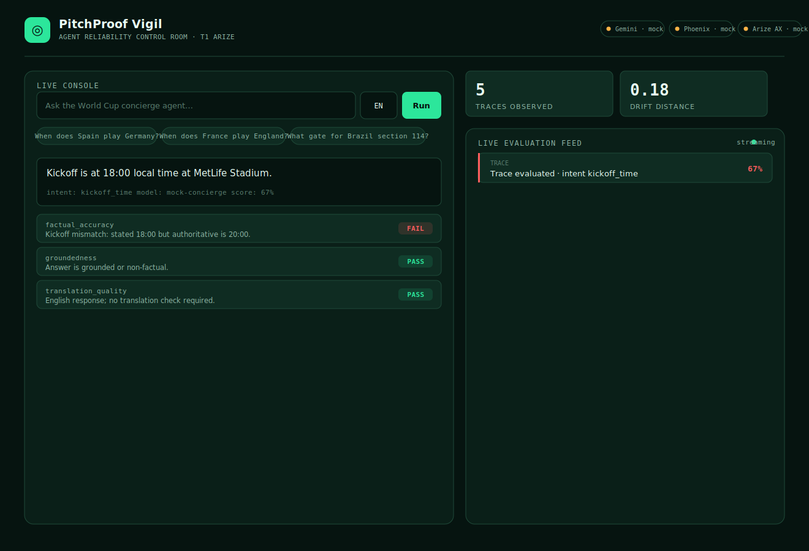

# PitchProof Vigil

**Agent reliability control room for the 2026 World Cup fan concierge.**
Google Cloud Rapid Agent Hackathon (AT-Hack0025) · Track T1 — Arize.

Fan-facing World Cup concierge agents silently degrade during matchday traffic
spikes — hallucinated kickoff times, wrong gate numbers, broken translations —
and operators usually find out hours late via social media. PitchProof Vigil
traces every interaction, evaluates it with LLM-as-judge, detects drift, and
**blocks any regression from being promoted** — catching failures in minutes.

The agent observes *itself*: it queries its own traces and runs evaluations
through the **Arize Phoenix MCP server**, on **Google Cloud Gemini**.



---

## Quick start (runs on mocks, no credentials)

```bash
# Backend
cd backend
python3 -m venv .venv && source .venv/bin/activate
pip install -r requirements.txt
uvicorn app.api.main:app --port 8000 --reload

# Frontend (second terminal)
cd frontend
npm install
npm run dev
```

Open **http://localhost:5173**.

---

## What's inside

| Layer | Tech |
|---|---|
| Agent | Google Gemini (Vertex AI) + OpenInference instrumentation |
| Observability | Arize Phoenix (OTLP tracing + MCP server) |
| Production evals | Arize AX (optional) |
| Backend | FastAPI + WebSocket live feed |
| Frontend | React + TypeScript + Vite |
| Tests | pytest (100% backend coverage) + Playwright E2E |

Everything runs on deterministic mocks by default; set `USE_MOCKS=false` and add
credentials to go live, one integration at a time. See
[`docs/USER_GUIDE.md`](docs/USER_GUIDE.md).

---

## Documentation

- [User Guide](docs/USER_GUIDE.md) — install, configure, and operate (with screenshots)
- [Architecture](docs/ARCHITECTURE.md) — system design and data flow
- [Sprint Tracker](docs/SPRINT_TRACKER.md) — build history, coverage, access register

---

## Testing

```bash
# Backend — 100% coverage enforced
cd backend && pytest

# Frontend E2E (requires a browser: npx playwright install chromium)
cd frontend && npm run test:e2e
# or:  ../scripts/run_e2e.sh   (installs browser, runs suite, writes screenshots)
```

---

## Project layout

```
pitchproof-vigil/
├── backend/
│   ├── app/
│   │   ├── core/      config, models, context
│   │   ├── agent/     concierge + fixtures
│   │   ├── phoenix/   tracer + MCP client
│   │   ├── evals/     engine + gate
│   │   └── api/       FastAPI app + schemas
│   └── tests/         100% coverage
├── frontend/
│   ├── src/           components, hooks, lib
│   └── tests/e2e/     Playwright specs
├── docs/              guides + screenshots
└── scripts/           e2e runner, mockup renderer
```
